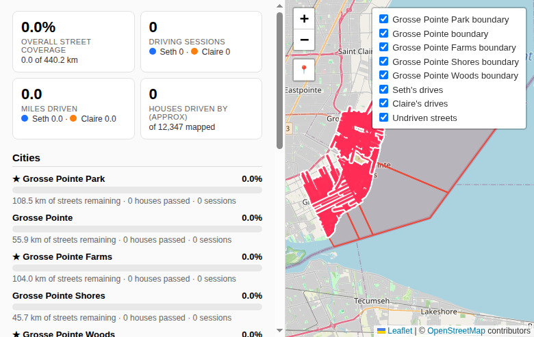
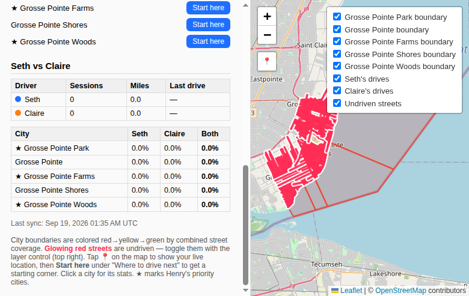

# Grosse Pointe Driving Coverage Tracker

> **Implementation status:** the original dashboard is a geographic prototype.
> The active product direction is documented in [the master plan](docs/MASTER_PLAN.md),
> with the recording decision in [the recording feasibility plan](docs/RECORDING_FEASIBILITY.md).
> Claims below about an existing workflow or deployment are historical intent until
> implemented and verified.

Seth and Claire are hunting their next primary home in the Grosse Pointes, Michigan —
not by scrolling listings, but by **driving 100% of the streets** in five adjacent
cities and learning the neighborhoods block by block ("driving for dollars").
This repo is the system that tracks the mission: it syncs both of their private
Strava drives, computes street-by-street coverage from real map data, and renders
a phone-friendly dashboard with a Seth-vs-Claire leaderboard, undriven-street
guidance, and suggested starting corners for the next drive.

**The whole thing runs itself and costs nothing:** a GitHub Actions workflow syncs
Strava every hour and deploys the dashboard to GitHub Pages. Public repos get
unlimited free Actions minutes, so there is no server, no subscription, and no
usage billed to anyone. The dashboard is a single self-contained HTML file.

## Screenshots



*Coverage cards, the five cities in Detroit-first order, and the map — city
boundaries colored by coverage, undriven streets glowing red.*



*The "Where to drive next" panel with per-city Start here buttons, the
Seth-vs-Claire leaderboard, and per-city coverage breakdown.*

## Purpose

Buying a primary home is a 10+ year decision, and listings only show you the
house — not the street, the block, or the neighborhood rhythm. Seth and Claire's
approach: systematically drive every street in the five Grosse Pointes (ordered
below from closest-to-Detroit south to north, which is also the dashboard's
display order):

1. ★ Grosse Pointe Park (borders Detroit directly)
2. Grosse Pointe (city)
3. ★ Grosse Pointe Farms
4. Grosse Pointe Shores
5. ★ Grosse Pointe Woods (up at 8 Mile)

★ marks Seth's priority-interest cities. All five are tracked: **440.2 km of
streets** total across the five cities (street networks fetched from
OpenStreetMap, September 2026).

Each drive is recorded in Strava as a private **Ride** activity ("Only You"
privacy — car speeds look implausible as a "Run", and private activities sync
fine through each owner's own token). The tracker answers the questions that
matter: *how much have we covered, where haven't we been, who drove more, and
where do we start tomorrow?*

## How it works

The loop is deliberately boring — drive, record, sync, look at the map:

1. **Drive.** Seth or Claire drives a session and records it in the Strava app
   as a Ride with "Only You" privacy. Nothing special to install; the phone
   they already carry does the GPS work.
2. **Sync (hourly, automatic).** A scheduled GitHub Actions run pulls new Ride
   activities from both Strava accounts, downloads each activity's GPS stream,
   and caches it. Sync is incremental — only activities newer than the last
   sync are fetched.
3. **Coverage math.** Every GPS track is buffered by 30 m (configurable). A
   street counts as "driven" if it intersects the buffered tracks. Per-driver
   and combined coverage are computed per city, plus miles, session counts,
   and an approximate houses-passed count (buildings whose centroid falls
   within 40 m of a track).
4. **Undriven guidance.** Street segments neither driver has touched are
   extracted as glowing-red map layers, and the largest undriven clusters per
   city become "start here" hotspots with real street-corner names and a
   Google Maps navigation link.
5. **Dashboard rebuild + deploy.** The pipeline renders a fresh self-contained
   `dashboard.html` and deploys it to GitHub Pages. Open the URL on any phone
   or computer — it's always current within the hour.

Locally, the same pipeline runs with `./run_all.sh` (Strava sync → OSM street
refresh if requested → coverage → undriven → dashboard).

## Design

### Pipeline architecture

Each stage is a small standalone Python script with a single job, communicating
through JSON/GeoJSON files in `data/`. You can run any stage alone, and a
failure in one stage doesn't corrupt the others' outputs.

| Stage | Script | Input | Output |
|---|---|---|---|
| Auth | `strava_auth.py` | Strava OAuth (one-time per athlete) | `tokens/*.json` locally, or refresh tokens in GitHub secrets |
| Sync | `sync.py` | Strava API (Rides only) | GPS streams in `data/tracks/` (cached, never committed); activity metadata in `data/activities_index.json` |
| Streets | `streets.py` | OpenStreetMap main API | `data/streets/*.geojson`, `data/boundaries/*.geojson`, `data/buildings/*.geojson` (cached) |
| Coverage | `coverage.py` | Tracks + streets + buildings | `data/coverage.json` (percentages, km, miles, houses, sessions, leaderboard) |
| Undriven | `undriven.py` | Tracks + streets | `data/undriven/*.geojson` (glowing segments), `data/starthere.json` (hotspots) |
| Dashboard | `dashboard.py` | All of the above | Self-contained `dashboard.html` (Leaflet via CDN; all data inlined) |

Everything spatial is projected to UTM 16N (EPSG:26916) for meter-accurate math,
then converted back to lat/lon for the map. Only real drivable road classes are
counted (motorway → living_street), clipped to each city's exact administrative
boundary.

### Privacy model (important)

The public repo and the public dashboard **never contain raw GPS history** —
your drives are your business:

- Per-drive GPS tracks live only in the GitHub Actions cache (`data/tracks/`);
  they are `.gitignore`d and never committed.
- The deployed dashboard is built with `PUBLIC_BUILD=1`, which strips the
  per-driver track layers entirely. What's published: aggregate stats, the
  leaderboard, city polygons, undriven streets, and start-here pins. The local
  build (without `PUBLIC_BUILD`) keeps the blue/orange per-driver track layers
  for private viewing.
- Strava credentials live only in GitHub repository secrets (or local
  `tokens/` files with `0600` permissions) — never in the repo, never in chat.
- `data/activities_index.json` (activity IDs, names, dates, distances — no
  GPS) is committed so a cache miss can still skip already-synced activities.

### Automation

`.github/workflows/sync.yml` runs on a schedule (hourly) and on manual
dispatch. Each run: checks out the repo, restores the track cache, syncs both
athletes, rebuilds everything with `PUBLIC_BUILD=1`, writes rotated Strava
refresh tokens back to repo secrets (Strava rotates refresh tokens on every
refresh — the workflow persists them so sync never breaks), and deploys to
GitHub Pages. No server, no cron on anyone's computer, no cost.

## Features

- **Combined coverage map.** All five city polygons on one interactive Leaflet
  map, colored red → yellow → green by combined street coverage. Click any city
  for its stats.
- **Seth-vs-Claire leaderboard.** Sessions, miles, and last-drive date per
  driver, plus a per-city breakdown (Seth % / Claire % / combined %) — the
  friendly competition layer.
- **Overall + per-city stats.** Total coverage %, km driven of 440.2, driving
  sessions, miles, and approximate houses passed (from ~12,347 OSM-mapped
  building footprints).
- **Undriven-street guidance.** Every street segment neither of you has driven
  glows red on the map (toggleable layer). Tap a glowing segment for its street
  name and length. Covered streets lose their glow on the next sync.
- **"Where to drive next".** Per-city **Start here** buttons drop a pin on the
  largest undriven cluster and name a real corner (e.g. "near the corner of
  Vernor Highway and Buckingham Road", from OSM street names), with a
  **Navigate in Google Maps** link for turn-by-turn directions to the pin. If
  you've shared your location, it picks the nearest big undriven patch to you
  and says so.
- **Phone-friendly with live location.** The dashboard is responsive and
  touch-friendly. Tap **📍 Locate me** for a pulsing-blue-dot live position
  (`navigator.geolocation.watchPosition`); tap **🧭** for follow mode that
  keeps the map centered while you drive. If location is denied, a small notice
  appears and everything else keeps working.
- **Zero-maintenance sync.** Hourly automatic Strava pulls, incremental (only
  new activities), refresh-token rotation handled by the workflow. Open the
  Pages URL anytime; it's current within the hour.

### Using it on your phone while driving

1. Open the GitHub Pages dashboard URL.
2. Tap **📍 Locate me** (allow location), then **🧭** for follow mode.
3. The glowing red streets are what's left — follow the glow.
4. Before a session, tap **Start here** for your target city, then **Navigate
   in Google Maps** to drive to the starting corner.
5. Record the drive in Strava as usual (Ride, Only You). At the next hourly
   sync, the streets you covered lose their glow.

## The five cities

| City | Street km | Buildings mapped |
|---|---|---:|
| ★ Grosse Pointe Park | 108.45 | 5,109 |
| Grosse Pointe | 55.94 | 653 |
| ★ Grosse Pointe Farms | 104.01 | 1,845 |
| Grosse Pointe Shores | 45.68 | 55 |
| ★ Grosse Pointe Woods | 126.12 | 4,685 |
| **Total** | **440.20** | **12,347** |

*Street networks and building footprints from OpenStreetMap, fetched September
2026. ★ = Seth's priority-interest cities.*

## Setup

### 1. Create one Strava API app (covers both athletes)

1. Go to https://www.strava.com/settings/api and create an application.
2. Set the **Authorization Callback Domain** to `localhost`.
3. Note the **Client ID** (appears in the OAuth URL — safe to share) and the
   **Client Secret** (never share in chat; it goes straight into a GitHub repo
   secret).

### 2. Authorize both athletes

For each of Seth and Claire:

```bash
export STRAVA_CLIENT_ID=<id> STRAVA_CLIENT_SECRET=<secret>
python strava_auth.py --athlete seth    # Seth opens the URL, authorizes, pastes the redirect URL back
python strava_auth.py --athlete claire  # Claire does the same on her Strava account
```

Tokens land in `tokens/seth.json` / `tokens/claire.json` with `0600`
permissions. For the GitHub Actions setup, the refresh tokens from these files
go into repo secrets instead (see below).

### 3. Run locally (optional)

```bash
python3 -m venv venv
venv/bin/pip install -r requirements.txt
chmod +x run_all.sh
./run_all.sh
```

Then open **`dashboard.html`** in your browser. The local build includes
per-driver GPS track layers (blue = Seth, orange = Claire); the public build
(`PUBLIC_BUILD=1`) omits them. Re-run anytime — sync is incremental. To refresh
street data: `./run_all.sh --refresh-streets`.

### 4. GitHub: hourly auto-sync + Pages dashboard

1. Push this repo to a **public** GitHub repository (public = unlimited free
   Actions minutes).
2. Add four repo secrets (Settings → Secrets and variables → Actions → New
   repository secret):
   - `STRAVA_CLIENT_ID`
   - `STRAVA_CLIENT_SECRET`
   - `SETH_REFRESH_TOKEN` — the `refresh_token` from `tokens/seth.json`
   - `CLAIRE_REFRESH_TOKEN` — the `refresh_token` from `tokens/claire.json`
3. Enable Pages: Settings → Pages → Build and deployment → Source: **GitHub
   Actions**.
4. The `Sync Strava coverage` workflow (`.github/workflows/sync.yml`) runs
   hourly and on manual dispatch: syncs both athletes, rebuilds the dashboard
   with `PUBLIC_BUILD=1`, persists rotated refresh tokens back to secrets, and
   deploys to Pages.

### Strava-side habits (important)

- Record each drive as activity type **Ride**.
- Set activity privacy to **Only You**. Private activities sync fine with owner
  tokens, and nobody can see or flag your drives.
- One shared Strava API app covers both athletes — each person authorizes once.

## How coverage is computed

- **Street data:** per-city street networks, building footprints, and exact
  administrative boundaries from the OpenStreetMap main API
  (`api.openstreetmap.org`) — per-city map tiles (recursive quad-split under
  the API's node limit) for streets/buildings, and `/relation/<id>/full` for
  boundaries. (Overpass was the original plan, but its chunked responses were
  intermittently truncated by the network's egress proxy; the main API proved
  fast and reliable.)
- **Coverage rule:** each GPS track is buffered by `buffer_meters` (30 m
  default, in `config.yaml`); a street counts as "driven" if it intersects the
  buffered tracks.
- **Houses driven by (approximate):** each building footprint is reduced to its
  centroid; a building counts as "passed" if its centroid falls within 40 m of
  any track. This is an approximation: OSM building data is community-mapped
  and **coverage varies wildly by city** — as of Sep 2026, Grosse Pointe Shores
  had only ~55 mapped buildings and Grosse Pointe (city) ~653, versus ~5,100
  for Grosse Pointe Park, so the houses metric understates reality in the
  sparsely mapped cities. Good enough for a vanity metric, not a census.
- `data/coverage.json` holds per-city totals, combined + per-driver
  percentages, km remaining, houses passed, per-city session counts, and the
  leaderboard.

## Files

| File | What it does |
|---|---|
| `config.yaml` | Cities, buffer, paths (no secrets; client ID via `STRAVA_CLIENT_ID` env) |
| `strava_auth.py` | Manual OAuth flow + `refresh()` helper; tokens → `tokens/*.json` locally or `<ATHLETE>_REFRESH_TOKEN` env in CI |
| `sync.py` | Incremental Strava sync (Rides only, GPS streams cached in `data/tracks/`) |
| `streets.py` | OSM street networks + boundaries per city (cached in `data/`) |
| `coverage.py` | Coverage math → `data/coverage.json` |
| `undriven.py` | Undriven segments → `data/undriven/*.geojson`; start-here hotspots → `data/starthere.json` |
| `dashboard.py` | Renders self-contained `dashboard.html` (Leaflet via CDN); `PUBLIC_BUILD=1` strips GPS track layers |
| `gen_sample_tracks.py` | Test helper: synthetic tracks on real streets |
| `run_all.sh` | Runs the whole pipeline locally |
| `.github/workflows/sync.yml` | Hourly Strava sync → rebuild → Pages deploy; persists rotated refresh tokens |
| `docs/screenshots/` | Dashboard screenshots used above |

## License

MIT — see [LICENSE](LICENSE).
